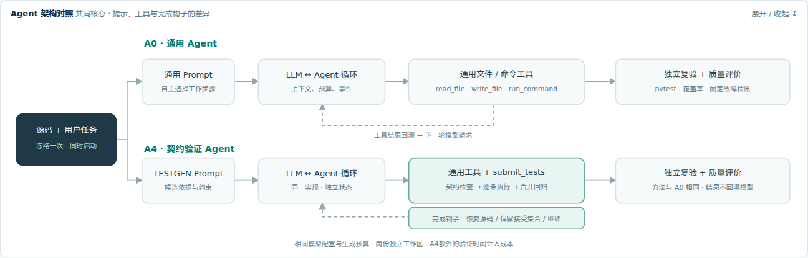

# Design：可运行、可核查的测试生成

Kytest Agent 面向 Python 函数级测试生成：用户提供源码和任务，模型通过工具生成 pytest 测试，执行后依据反馈修正。CLI 与 Web 共享同一控制循环；Web 可在同一输入下并行比较通用生成与契约验证。

设计需要分别回答三个问题：测试是否实际通过，断言能否识别错误行为，以及过程消耗了多少资源。模型的完成声明、测试通过和质量评价因此分别记录。

## 输入与产物

输入是工作区内的 `solution.py` 与用户任务。主要产物是 `test_solution.py`；契约验证另生成 `testgen_report.json`，可选开发故障反馈另生成 `fault_feedback.json`。事件记录模型公开说明、工具参数、返回结果、成本与结束原因。

支持范围是自包含的 Python 函数。候选验证有意限制测试形式，以便定位单项失败；依赖安装、服务部署与跨系统集成测试不属于当前目标。配置与操作见 [README.md](README.md)。

## 架构与职责



| 模块 | 拥有的职责 |
|---|---|
| `cli.py`、`web/` | 接收输入、展示事件、取消任务与导出产物 |
| `assembly.py` | 根据 `AgentPolicy` 统一装配模型、工具、钩子与预算 |
| `agent/`、`llm.py` | 维护上下文与任务状态，推进模型请求和工具调用 |
| `tools/`、`testgen.py` | 执行操作；维护目标源码、候选与接受套件 |
| `pytest_result.py`、`coverage.py`、`eval/` | 解析执行事实、测量覆盖率和独立故障检出 |

入口选择策略，核心负责推进任务，工具负责执行。核心通过结构化事件连接终端、浏览器和评测程序，展示层无需解析终端文字重建状态。

`TestGeneration` 统一拥有目标源码、接受套件、执行成本、开发反馈与停止状态。`submit_tests` 和 `inspect_survivors` 是同一对象的工具适配器；调用方通过操作与快照访问状态，工具之间无需互相访问内部字段。

一次模型响应及其工具调用构成一个轮次。工具结果写回上下文，模型继续修正或完成任务。完成、预算耗尽、请求失败和用户停止都有独立结束状态。CLI 保留会话上下文，同时为新任务重新计量预算。

## 两种生成路径

**通用生成**让模型自主读取源码、写入测试并决定何时执行 pytest。系统提供通用工具与资源边界，模型决定测试结构、验证步骤及结束时机。

**契约验证**将提出候选与维护产物分开。每条候选包含测试代码、契约引用、合法输入域、独立预期值理由和故障假设。以包含两个端点的区间分类函数为例：

```python
from solution import classify


def test_lower_boundary_is_inside():
    assert classify(2, 2, 8) == 0
```

预期值 0 来自“包含下端点”的契约，能识别把 `<` 写成 `<=` 的错误。用被测函数再次计算预期值，或使用无关断言，则不能提供独立判断。

候选验证依次检查：

1. 契约引用、可识别的输入约束与断言依赖；拒绝无关断言、自比较和消去目标影响的表达式。
2. 单项实际执行；记录目标调用参数，补充静态检查无法识别的动态输入。
3. 与已接受套件合并回归；成功后加入接受集合，失败时返回具体候选的原因。

已接受项保留，重名候选不能覆盖它们。轮次结束时恢复原始目标源码并重新发布接受集合，防止直接写文件绕过验证。原有测试可作为合并基底，但不会因此获得逐项认证。无法解析的约束明确标为未检查，契约依据与参考通过也不构成完整正确性证明。

## 可选开发故障反馈

`--fault-feedback` 在契约验证上增加 `inspect_survivors`。它对已接受套件执行有限的开发故障，返回尚未识别的改动，促使模型补充能区分行为的合法输入。新增测试仍须经过相同候选验证。

开发池使用算术与常数替换，独立评价池使用比较、逻辑连接与布尔常数替换；按 AST 指纹核对无交集。相同套件的查询使用缓存，改变后的套件最多检查两轮。新增检出与丢失检出分别记录。

未检出的改动可能在合法输入域上等价；超时不能算确认检出。开发目标全部消失只说明这组目标已处理，不代表独立质量达标。

## 执行事实与资源边界

命令执行返回退出码、超时、启动错误、采集截断与原始输出。共享解析器从完整 pytest 摘要及测试节点判断结果；展示文本的截断不参与判断。未执行、无完整摘要或全部跳过的套件不能确认为通过。覆盖率执行与目标文件解析也使用共享实现，缺失或失真的测量明确报告为不可用。

文件工具限制工作区、符号链接与文件大小。命令使用参数列表执行，不经过 shell，限制运行时间与输出，并过滤模型服务凭据。默认 Bubblewrap 隔离网络和宿主文件；隔离不可用时拒绝执行。`trusted` 是显式选择的本机执行模式，拥有宿主权限。

每个工具调用对应一条返回消息。上下文裁剪保留完整调用组，取消时补齐尚未执行的工具返回。持久化事件在保留结构的同时脱敏凭据。模型响应因输出限额截断时，不执行其中的工具调用；服务失败经过有界重试后报告明确状态。

| 控制层 | 限额与行为 |
|---|---|
| 模型循环 | 轮次、请求超时、上下文长度、累计 token 与任务时间 |
| 候选验证 | 每批最多 6 条、每任务最多 24 次尝试；单项 2 秒、合并 5 秒，每项最多 128 次目标调用 |
| 开发反馈 | 最多 8 个故障、两轮改变套件后的检查，重复查询缓存 |
| 用户停止 | 在请求与工具边界取消后续动作，保留结束原因和已有记录 |

累计 token 与任务时间在轮次边界检查，属于软上限；单次请求或执行可能使总量超出。相同名义预算不能视作严格等成本。

## 独立评价与设计取舍

Web 冻结共同源码、任务与模型配置，同时启动独立工作区、上下文和预算计数。生成结束后，两组执行相同的参考复验、覆盖率与固定故障评价，结果只用于展示，不回灌模型。系统验证与最终评价的开销分别记录。

有效性要求测试实际通过且目标未被改写。覆盖率描述执行路径；固定故障检出描述断言在有限故障池中的判别力。无效产出的主分数计 0，超时或疑似等价项保留分母，不算确认检出。工程回归与脚本演示验证机制，真实模型实验评价产出质量。

契约验证提供明确的失败定位与增量保留，也增加执行成本、限制测试形式。现有实验观察到更高的有效产出率，但尚未通过预设总体质量优势验收。因此通用生成保持默认，契约验证与开发反馈按需启用。结果、统计和限制见[评价说明](docs/evaluation.md)。
