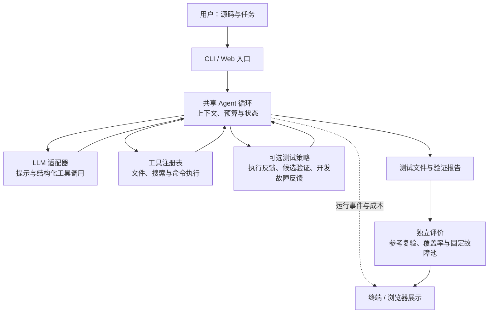

# Design：可运行、可验证的测试生成 Agent

本项目面向 Python 函数级单元测试生成。用户提供源码和任务，Agent 调用语言模型规划工作，通过文件与执行工具生成 pytest 测试，再依据工具反馈修正。CLI 与 Web 提供两种交互入口，共享同一份 Agent 循环。

设计围绕三个目标展开：测试能够运行，断言能够区分错误行为，过程与成本能够追踪。通用工具支持模型自主完成任务；测试专用机制提供可选择的提示、验证与故障反馈。是否采用这些机制，需要同时考察产出质量和运行成本。

## 1. 需求与成功标准

### 1.1 输入、输出与适用范围

输入包括工作区中的 `solution.py`、函数契约及用户任务。主要输出为 `test_solution.py`；候选验证模式另生成 `testgen_report.json`，开发故障反馈模式另生成 `fault_feedback.json`。运行事件记录模型的公开说明、工具调用、返回结果和结束状态。

项目支持自包含的 Python 函数测试。通用模式也可用于代码解释等文件级任务；候选验证模式则有意限制测试形式，以便逐条执行和定位失败。复杂仓库的依赖安装、服务部署与跨系统集成测试超出本项目的支持范围。具体配置与操作见 [README.md](README.md)。

### 1.2 有效性、判别力与成本分别衡量

有效测试应能被 pytest 收集，在参考实现上通过，并保持目标源码完整。空测试、全部跳过或修改实现来迁就断言，都不能构成有效产出。有效性只说明测试与参考实现一致，参考实现本身也可能有缺陷。

判别力要求断言能够识别错误行为。例如，示例函数 `classify(value, low, high)` 约定：低于区间返回 −1，高于区间返回 1，包含两个端点的区间内返回 0。因此下端点测试可以写成：

```python
from solution import classify


def test_lower_boundary_is_inside():
    assert classify(2, 2, 8) == 0
```

这里的预期值来自包含边界的契约，能够识别将 `value < low` 错写为 `value <= low` 的故障。`assert True` 虽然通过，却没有这种作用；用被测函数再次计算预期值，也不能提供独立判断。

覆盖率用于观察哪些代码路径得到执行，故障检出用于观察断言是否区分了错误行为。两者分别测量。成本则记录模型轮次、工具调用、输入与输出 token、生成耗时，以及系统验证和最终评价的执行开销。

## 2. 整体架构与任务流程

### 2.1 共享循环，分离交互、执行与评价

运行层使用 Python 标准库，通过 OpenAI 兼容接口调用模型；pytest、coverage 与统计分析依赖用于各自的验证任务。模型适配、工具执行和界面展示各自承担清晰职责，测试策略通过提示、工具注册与轮次钩子接入。



生成过程中的反馈可以影响后续动作。最终评价在生成结束后进行，结果只用于展示与比较，不回灌模型。

| 组件 | 职责 | 实现入口 |
|---|---|---|
| 交互入口 | 接收任务、装配配置、展示状态与下载产物 | `cli.py`、`web/server.py` |
| Agent 核心 | 推进轮次、维护上下文、检查预算、发出事件 | `agent/core.py`、`agent/state.py`、`agent/events.py` |
| 模型适配 | 请求兼容 API、解析响应与用量、处理超时和重试 | `llm.py` |
| 工具与测试策略 | 执行文件和命令操作、验证候选、提供开发反馈 | `tools/`、`testgen.py`、`test_contracts.py`、`fault_feedback.py` |
| 验证与评价 | 参考执行、覆盖率测量、独立故障评分和实验汇总 | `eval/`、`web/quality.py` |

运行模块位于 `src/code_agent/`。核心通过事件接口连接 CLI、Web 与评测程序，避免依靠解析终端文本重建状态，也使同一控制流程能够在不同入口下接受验证。

`assembly.py` 统一模型客户端、工具注册表、验证钩子及运行预算的装配。入口通过 `AgentPolicy` 明确选择提示、工具和测试验证策略；CLI 与 Web 使用交互提示，评测保留实验配置中的提示和预算。会话记录、取消操作、checkpoint 与评分由对应入口负责。

测试生成由 `TestGeneration` 统一拥有目标源码、接受套件、执行成本、开发反馈和停止状态。`submit_tests` 与 `inspect_survivors` 是同一对象的工具 adapter；评测读取独立快照，实验观察订阅开发反馈，工具之间无需相互访问内部状态。

命令执行统一返回退出码、超时、启动错误、采集截断及原始输出。`pytest_result.py` 从采集输出提取最后一条完整 pytest 摘要和已报告的测试节点，供候选验证、执行反馈与独立评价共享；诊断文本的展示截断不参与判断。未执行、无有效摘要、仅跳过或采集不完整的运行不能确认为通过。契约检查和各故障池的检出规则由对应调用方负责。

`coverage.py` 共享覆盖率执行、报告导出及目标文件解析。各入口明确选择执行命令与导出条件，并分别负责未覆盖行反馈、失真校验及展示指标。

### 2.2 一次任务如何完成

1. 入口读取工作区和任务，装配模型、提示、工具、权限及预算。
2. 核心将任务与已有上下文交给模型，获得公开说明或结构化工具调用。
3. 工具注册表校验参数并执行调用，将成功结果或错误观察写回上下文。
4. 所选策略检查本轮产物，必要时追加验证反馈；模型依据反馈继续生成或修正。
5. 模型完成、策略收尾、预算耗尽、请求失败或用户停止时，核心报告结束原因，入口展示产物和成本；配置了最终评价的入口随后独立评价测试。

一个轮次包含一次模型请求及其触发的工具执行。模型负责提出测试输入、预期值与下一步动作；系统负责参数检查、权限边界、执行限额、接受集合和状态记录。模型说“完成”与测试实际有效是两个分别报告的状态。

CLI 保留会话上下文，后续任务可以引用先前信息，同时重新计量任务预算。Web 对比冻结同一份源码、任务和模型配置，同时启动两个 Agent，各自使用独立工作区、上下文和预算计数。浏览器展示真实事件，服务端负责模型请求与执行，评价结果与生成反馈分开记录。

## 3. 测试生成的关键机制

### 3.1 提示明确目标，执行反馈验证产物

测试提示要求模型考虑正常值、合法边界和有契约依据的异常行为，并写出具体断言。这为模型提供任务方向，但增加清单不能补足错误的预期值，也不能赋予源码未承诺的行为。例如，输入前提并不自动意味着函数应对越界输入抛出异常。

执行反馈将模型生成的文件交给 pytest，返回失败位置和执行状态，使修正有具体依据。自动执行策略仅在测试文件内容变化时运行，限制重复验证；测试通过后可收尾，减少模型继续自检的轮次。这一停止规则节省工作，也可能在测试刚能运行时结束探索，因此必须与判别力分别评价。

覆盖率反馈在测试通过后定位未执行行，要求追加能够执行这些路径的测试。它解决路径遗漏，仍需要模型为新输入构造有意义的断言。若现有测试已经全覆盖，定向补测机制不会激活。

### 3.2 候选验证把失败定位到单项测试

整份测试文件重写容易让一个错误断言阻塞其他测试，也可能丢失已经正确的用例。候选验证通过 `submit_tests` 接收单项测试，将生成、验证和保留分成明确步骤。

每条候选需要提供契约引用、合法输入域、独立预期值的推导，以及希望识别的错误行为。以区间示例为例，输入满足 `low <= high`，预期值 0 来自“包含下端点”的约定，故障假设是比较运算符错误。依据用于审查和约束候选，不被当作正确性证明。

工具对可识别的输入约束和断言结构进行检查，拒绝无关断言、自比较及代数消去等弱锚点；执行时记录实际目标调用参数，补充静态检查看不到的动态输入。无法解析的约束明确标为未检查。

候选先单独执行，通过后再与已有套件合并回归；只有两步都成功才进入接受集合。失败反馈定位到具体候选，已接受测试保留，重名候选不能覆盖它们。每轮结束时重新发布接受集合并恢复原始目标源码，避免直接写文件绕过验证。已有测试作为基底参与合并，不能因此被视为已经逐条认证。

接受集合表示通过这些检查的测试，不等于完整契约证明。候选通过后也不会以最终故障分数决定停止；模型可以继续补充互补用例。

### 3.3 开发故障反馈检验断言的区分能力

参考执行通过之后，套件仍可能漏掉包含边界、逻辑连接或返回类型等错误。`inspect_survivors` 在已接受套件上运行一组有限的开发故障，返回尚未被断言识别的改动，提示模型提出能够区分两种行为的合法输入。新增候选仍须经过单项验证和合并回归。

开发池使用算术与常数替换，最终独立评分池使用比较、逻辑连接与布尔常数替换；两池按 AST 指纹核对无交集。相同套件重复检查复用缓存，改变后的套件最多接受两轮开发检查。仍有待区分目标且预算允许时要求补充测试，目标耗尽、预算耗尽或无进展时停止。

未检出的改动可能在合法输入域上等价，超时也不能直接解释为确认检出。开发目标全部消失只说明这组反馈目标已处理，不代表独立质量达标。分别记录新增检出和丢失检出，可以观察补充测试是否带来实际增量。

### 3.4 用统一配置比较机制

所有配置共享 Agent 循环与通用工具。机制差异集中在提示、工具和钩子中，便于对照；共享实现不能自动消除停止规则、系统执行开销或模型服务波动的影响。

| 配置 | 策略与工具 | 系统反馈及收尾 |
|---|---|---|
| A0：通用 | 通用提示和文件、搜索、命令工具 | 模型自主决定是否运行 pytest，按回答与预算结束 |
| A1：测试提示 | 在通用配置中加入测试目标与断言要求 | 验证动作仍由模型决定 |
| A2：执行反馈 | 测试提示与通用工具 | 文件变化后自动运行 pytest，失败回灌，通过收尾 |
| A3：覆盖率反馈 | 执行反馈配置 | 通过后检查未覆盖行，要求定向补测或收尾 |
| A4：候选验证 | 契约提示、通用工具和 `submit_tests` | 单项验证、合并回归、增量保留，轮次钩子保护产物 |
| A5：开发故障反馈 | 候选验证配置与 `inspect_survivors` | 接受套件后检查开发故障，反馈剩余目标并限制补测 |

A4 与 A3 使用不同机制组合：候选验证直接接入共享核心，不继承自动覆盖率补测。CLI 提供通用、候选验证与开发反馈模式，Web 重点展示 A0/A4 同输入对比；A1～A3由评测入口配置，用于区分提示和系统反馈的作用。

## 4. 可靠性、资源控制与可维护性

### 4.1 错误作为可定位的观察结果

工具以 JSON Schema 描述参数，统一返回成功或失败结果。未知工具、缺失参数、类型错误和执行异常都会形成对应观察，便于模型修正。模型响应因输出上限截断时，不执行该响应中的工具调用；请求超时或服务失败经过有界重试后报告明确结束状态。

每个工具调用对应一条返回消息。上下文裁剪以 assistant 消息及其全部工具返回为一组，防止孤立返回破坏 API 消息序列。运行日志保持事件结构，并在持久化前脱敏密钥等凭据。

### 4.2 权限与执行隔离

文件工具限制工作区路径、符号链接和文件大小。命令采用参数列表执行，不经过 shell；执行器限制超时与输出量，并过滤子进程环境，避免继承模型服务密钥。

默认使用 Linux/WSL 的 Bubblewrap，挂载工作区和只读运行库，隔离网络；隔离不可用时拒绝执行。只读策略同时限制文件工具与命令写入，禁用执行策略阻止命令和候选执行。`trusted` 是明确选择的受信本机执行模式，拥有宿主权限；工作目录限制和命令黑名单不能替代隔离。

测试生成模式保存目标源码，并在候选执行与发布时恢复它。Web 最终复验和独立评测另行检查源码完整性，防止通过修改被测程序获得有效产出。

### 4.3 用明确限额约束修正过程

| 层级 | 控制方式 | 目的 |
|---|---|---|
| 模型循环 | 轮次、请求超时、上下文长度与累计 token 预算 | 控制请求规模，报告完成与预算耗尽的区别 |
| 自动执行反馈 | pytest 最多4次，覆盖率反馈最多2轮 | 避免无变化验证和无限修正 |
| 候选验证 | 每批最多6条，每任务最多24次候选尝试；单项2秒、合并5秒；每项测试最多128次目标调用 | 限制非法输入、巨大枚举和慢测试的影响 |
| 开发故障反馈 | 最多8个故障、两轮改变套件后的检查，重复查询缓存 | 限制反馈成本，保留进展记录 |
| 用户控制 | 明确结束原因，在请求与工具边界响应停止 | 使用户能够识别当前状态与中止工作 |

累计 token 与任务墙钟预算在轮次边界检查，属于软上限，单次请求或执行可能使总量超出。单项执行超时与调用限额是局部硬边界，两者不混作严格等成本保证。

清晰的模块接口使模型适配、工具策略与展示可以分别维护。工程回归重点检查接口之间的行为约束：消息配对、错误传播、任务预算重置、权限执行、候选保留和反馈池分离。

## 5. 验证依据与设计取舍

### 5.1 区分功能验证与质量评价

工程回归验证控制流程和边界处理是否工作，包括模型响应解析、工具参数、消息顺序、路径限制、进程超时、接受集合及故障反馈。离线演示使用脚本化模型和真实工具，适合复现机制行为；真实模型的产出质量由配对实验单独评价。

质量评价先执行冻结参考：未产出有效测试或目标被改写时，主分数计0。有效套件再测覆盖率与固定故障池的检出。确认检出评价中，超时和疑似等价故障保留分母，不算确认检出；各实验的故障池与计分规则分别报告，分数只在同一协议内比较。独立评价结果不进入生成上下文，避免把对反馈样本的适配当作泛化能力。

同一实验内统一源码、任务、模型配置和名义预算，并分别记录系统执行成本。重复实验先对同一任务的多次运行聚合，再比较任务之间的配对差值，避免将重复生成当成独立任务。完整矩阵、评价协议、统计和证据入口见 [实验摘要](submission/EXPERIMENTS.md)。

### 5.2 证据如何影响设计选择

HumanEval 对照中，执行反馈配置使用较少的返回 token，但相邻机制的质量差异未达到统计显著性；覆盖率检查均为全覆盖，定向补测没有激活。因此这些记录支持关注执行编排的成本作用，不能证明覆盖率补测带来了质量收益或退步。

MBPP 的20题、每配置三次对照中，通用配置有效产出49/60，候选验证与开发反馈配置各59/60。候选验证的确认独立检出率为74.94%，通用配置为68.81%；观察差值为6.13个百分点，但置信区间包含0，未通过预设质量优势验收。开发故障反馈出现单例新增独立检出，没有平均质量优势证据；token 用量下降也没有带来耗时同步下降。

据此，通用 Agent 保持默认，候选验证和开发故障反馈作为可选机制。它们提供更明确的候选依据、失败定位和保留规则，同时增加验证成本与测试形式约束；使用者可以依据任务需要选择。Web 对比展示同一输入的过程、质量和成本，具体演示样例只代表该次运行。

### 5.3 适用边界

契约引用与参考通过无法认证所有预期值。独立重放中，一份随机排序测试暴露了参考实现对合法输入的缺陷，原始失败与0分保留。因此产出有效率应解释为参考一致性，不能当作预期值正确率。

公开基准的模型预训练接触未知，函数级实验也不能直接外推真实仓库的缺陷发现能力。有限样本中未检出差异，不代表质量等价。提示、覆盖率、候选验证和故障反馈分别解决不同问题；本项目的设计价值在于让这些作用能够被执行、观察和独立检验。
