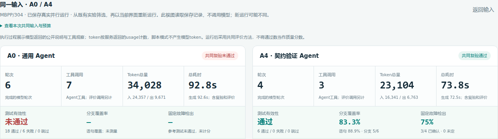

# Kytest Agent：Python 测试生成助手

给定 Python 函数源码和任务，Kytest Agent 通过语言模型与文件、执行工具的循环生成 pytest 测试，并依据反馈修正。项目提供 CLI 和 Web 交互；Web 支持同一输入并行比较通用生成与契约候选验证，展示实际工具记录、测试质量和运行成本。

[快速开始](#快速开始) · [使用方式](#使用方式) · [结果与验证](#结果与验证) · [设计说明](Design.md) · [57秒演示视频](docs/demo.mp4)



截图来自已保存的 MBPP/304 真实案例：A0 有6项失败，A4 全部通过、检出3/4个固定故障。视频展示同一题的另一轮实际执行，等待片段标注8倍速，操作与结果保持原速。两者均为筛选的展示样例，新运行结果可能不同；[案例说明](docs/rotation-example.md)给出保存记录的评价口径。

## 快速开始

推荐 **Ubuntu 或 Ubuntu WSL、Python ≥3.9**。以下命令在包含 `main.py`、`web.py` 和 `requirements.txt` 的项目根目录执行。首次体验无需模型密钥。

Ubuntu/WSL 首次使用时安装虚拟环境与命令隔离组件：

```bash
sudo apt install python3-venv bubblewrap
```

创建虚拟环境、安装依赖并启动 Web：

```bash
python3 -m venv ~/.venvs/kytest-agent-homework
source ~/.venvs/kytest-agent-homework/bin/activate
python -m pip install -r requirements.txt
python web.py
```

打开 **http://127.0.0.1:8765**，点击 **“查看已保存差异案例”**，即可查看原始工具轨迹、两组测试与质量结果。该入口读取保存记录，不重新请求模型。

Agent 核心使用 Python 标准库；pytest 用于执行测试，coverage 用于覆盖率测量，SciPy 用于统计复核。默认执行隔离依赖 Bubblewrap，虚拟环境放在 Linux 文件系统中可避免含空格路径带来的执行问题。按 Ctrl-C 结束 Web 服务。

## 使用方式

### 选择体验方式

| 方式 | 需要密钥 | 实际发生什么 |
|---|---|---|
| 已保存差异案例 | 否 | 展示此前真实模型运行的公开事件、产物与结果，不产生新调用 |
| 离线演示 · 脚本化 | 否 | 使用固定模型响应，实际执行文件工具、候选验证和 pytest，演示控制流程 |
| 真实模型 | 是 | 当场请求配置的模型并执行工具，结果与耗时可能变化 |

离线脚本对比中，两组最终测试相同，A4 包含刻意错误候选，用于观察拒绝与修正；其质量和模拟用量不能作为真实模型成绩。

### 在 Web 中完成一次对比

1. 查看 A0/A4 机制卡片与架构图，确认两种生成方式的差异。
2. 在真实模式选择或编辑源码与任务；离线脚本模式使用固定示例。
3. 点击 **“同一输入对比 A0 / A4”**，两组同时启动，共享输入和配置，各用独立工作区与状态。
4. 查看模型公开说明、工具参数及返回结果；展开 A4 候选，检查契约依据、拒绝原因和接受记录。
5. 在结果卡片与“质量评价”中检查有效性、覆盖率、固定故障检出和成本，下载测试、验证报告与运行记录。

取消“跟随最新”可检查历史事件；点击“停止两组”取消后续动作，当前请求或工具需要先结束。详细操作见 [演示说明](docs/demo.md)。

### 配置真实模型

在项目根目录复制 `.env.example` 为 `.env`，填写支持工具调用的 OpenAI 兼容服务配置：

```dotenv
LLM_API_KEY=你的密钥
LLM_BASE_URL=服务的兼容API地址
LLM_MODEL=支持工具调用的模型名
```

三项都填写后重启 `python web.py`，再选择“真实模型”。对比会同时运行两个 Agent，各自产生模型请求；界面显示返回用量与实际耗时。密钥保留在服务端，`.env` 不进入 Git。

### 使用命令行

候选验证模式的示例命令：

```bash
python main.py -C examples --test-generation --max-turns 12 \
  --max-output-tokens 4096 --max-tokens 30000 \
  --print "为 solution.py 生成 pytest 测试，覆盖正常值与包含边界"
```

`examples/solution.py` 中的 `classify` 约定：区间内返回0，下方返回−1，上方返回1；例如 `classify(2, 2, 8) == 0`。将 `-C examples` 换成自己的函数工作区，确保其中包含 `solution.py`。策略选项可以按下表替换：

| 策略 | 命令选项 | 处理方式 |
|---|---|---|
| A0：通用 | 去掉 `--test-generation` | 模型自主读取、写入和运行测试 |
| A4：候选验证 | `--test-generation` | 提交契约依据，逐条验证、合并回归并保留接受项 |
| A5：开发故障反馈 | `--fault-feedback` | 在候选验证上追加有界开发故障反馈，属于可选实验机制 |

去掉 `--print` 进入连续对话，输入 `exit` 退出；Ctrl-C 中止当前任务。`--mode json` 输出逐行事件，`--no-session` 关闭默认保存到工作区 `.sessions/` 的脱敏轨迹。完整参数见 `python main.py --help`。

CLI 缺少模型配置时会明确提示使用 Mock；需要真实生成时先检查配置。Web 的真实模式在缺少配置时不可选，两种入口均区分离线与真实运行。

## 结果与验证

### 产物与指标

CLI 的测试文件写入 `-C` 指定的工作区；Web 使用临时工作区，结果通过页面下载，需在结束服务前保存。

| 产物 | 内容 |
|---|---|
| `test_solution.py` | 最终测试套件 |
| `testgen_report.json` | A4/A5 候选依据、接受与拒绝记录、验证状态 |
| `fault_feedback.json` | A5 开发故障反馈与增量记录 |
| 运行记录 | 模型公开说明、工具参数与返回、结束原因和成本；Web 可下载，CLI 可保存会话轨迹 |

结果应分别查看以下指标：

| 指标 | 含义 |
|---|---|
| 测试有效性 | 实际执行、参考通过且目标源码未改写；空测试与全部跳过不算有效 |
| 语句/分支覆盖率 | 已执行代码路径的比例，不能替代断言的判别力 |
| 固定故障检出 | 有效测试在匹配样例的固定故障池上确认识别的错误，参考失败时不计分 |
| 运行成本 | 轮次、Agent 工具调用、输入/输出 token 和耗时；系统验证及最终评价开销分别记录 |

Web 在生成结束后对两组执行同样的独立评价，结果不回灌模型。未配置的故障池和未测量指标明确标注，不能当作0分。参考通过表示与参考实现一致，不认证所有预期值正确；固定池检出也不代表能发现任意真实项目缺陷。

### 运行工程与统计检查

```bash
python -m pytest tests/ -q
python scripts/reproduce_submission.py
```

第一条执行工程回归；第二条核对280行既有实验记录的成员、固定分母、均值与配对统计，成功时输出 `all_matches: true`。两条均不需要模型密钥，不重新生成测试或改写原始实验记录。

不启动浏览器也可运行一次完整离线工具闭环：

```bash
python scripts/demo_offline.py
```

预期观察到源码读取、测试写入与实际 pytest 执行，5项测试通过并报告任务完成。这验证控制流程，模型响应由脚本提供，不用于衡量模型能力。

### 实验结论

在 MBPP 的20题、每配置三次对照中，A0 有效产出49/60，A4 与 A5 各59/60；A4 确认独立检出率为74.94%，A0 为68.81%。观察差值未通过预设统计验收，尚不能认定总体质量优势，因此默认保留通用 Agent，A4/A5 为可选机制。完整配置、结果与证据边界见 [实验摘要](submission/EXPERIMENTS.md)。

## 常见问题与范围

| 问题 | 处理 |
|---|---|
| 没有密钥或真实模式不可选 | 可查看保存案例或运行脚本演示；真实生成需填写三项模型配置并重启 Web |
| pytest/coverage 不可用 | 激活启动 Agent 的虚拟环境，在同一解释器中运行 `python -m pip install -r requirements.txt` |
| Bubblewrap 不可用或隔离失败 | 检查安装及系统用户命名空间支持；默认拒绝执行。保存案例仍可查看；`trusted` 仅用于受信本机代码，拥有宿主权限 |
| 8765端口占用 | 运行 `python web.py --port 0`，打开终端打印的实际地址 |
| 运行等待过久或预算结束 | 查看请求、工具及结束状态；可停止后续动作，当前请求或工具需先结束。累计 token 与任务时间为轮间软限制 |

项目支持自包含的 Python 函数测试，不自动处理任意仓库的依赖、服务与集成环境。候选验证限制测试形式；复杂契约和预期值仍需审核。总体质量判断依据完整实验，展示样例只代表对应运行。

[Design.md](Design.md)说明架构、机制和设计取舍；[实验摘要](submission/EXPERIMENTS.md)报告 A0～A5 配置与实验依据；[操作说明](docs/demo.md)提供详细页面操作和评价口径。
